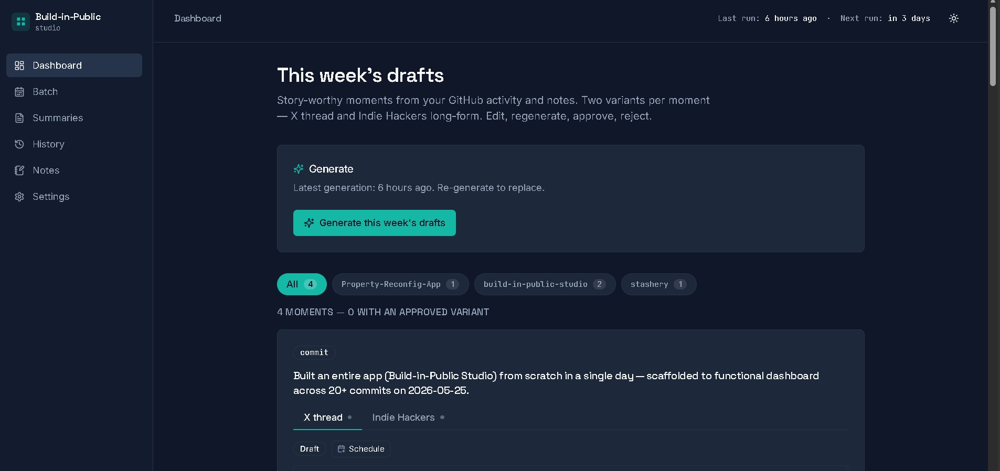
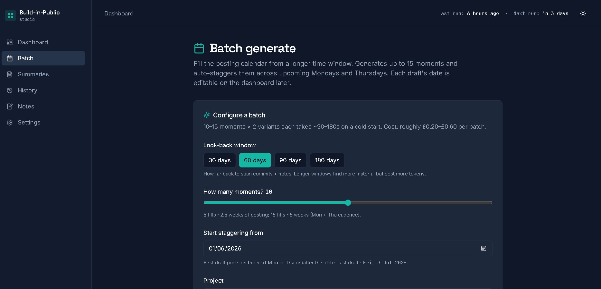
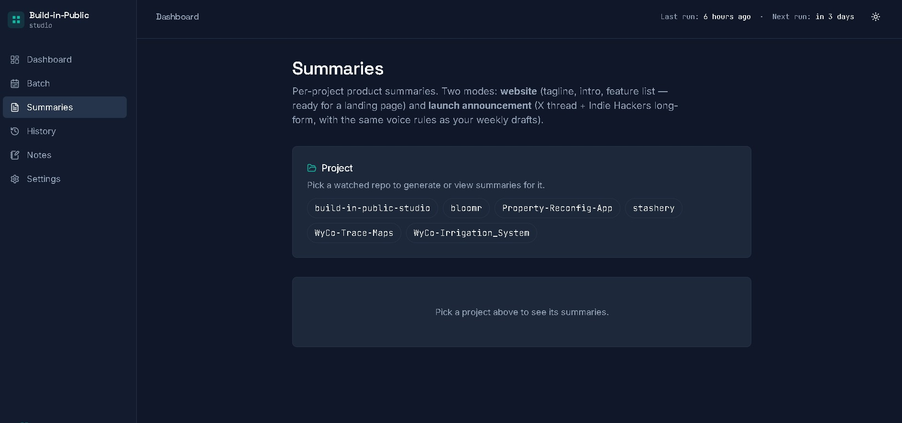
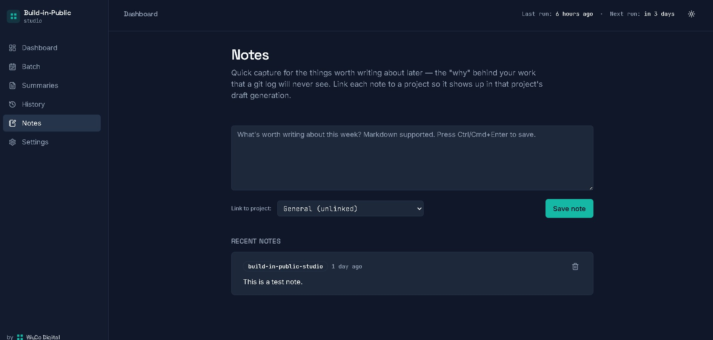
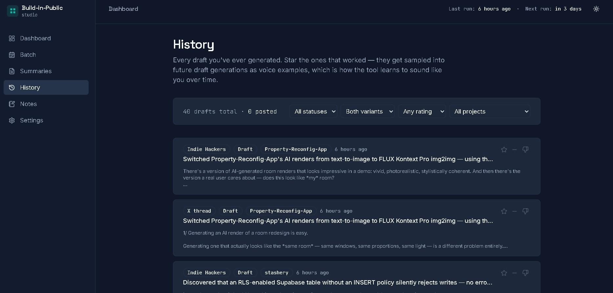
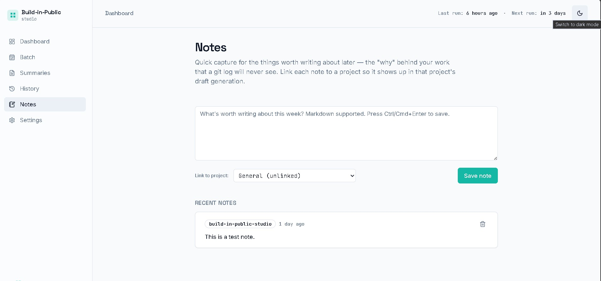

# Build-in-Public Studio

**Turn your week's commits and notes into ready-to-ship X threads and Indie Hackers posts. Auto-drafts twice a week. Stays out of your way.**

A self-hosted web app that pulls your GitHub activity and weekly notes, asks Claude to identify story-worthy moments, and drafts an X thread and an Indie Hackers long-form post for each. You review, edit, approve, copy + open the platform. Nothing auto-publishes. Ever.

**100% of the code in this repo is Claude-generated.** Every line. That is not a footnote; it is the whole point. See [Why this exists](#why-this-exists).



---

## What it does

- **Watches your repos.** Pulls commits from the GitHub repos you've selected, keeps the last 7 days in cache.
- **Reads your notes.** A quick-capture page where you write down the *why* behind the work — the parts a `git log` will never see. Link each note to a project.
- **Drafts on a twice-weekly rhythm.** Every Monday and Thursday at 09:00 UK, it asks Claude to find 3–5 *moments* worth posting about and drafts two variants for each: an X thread and an Indie Hackers long-form. Triggered by Vercel Cron, runs in the background while you sleep.
- **Batch-fills your calendar weeks ahead.** Pick a 60–180 day window, generate 10–15 moments, auto-staggered across upcoming Mondays and Thursdays. Edit any date per draft.
- **Generates product summaries per project.** Two modes — *website summary* (tagline, intro paragraphs, feature list, ready for a landing page) and *launch announcement* (X thread + IH long-form when you're shipping something publicly).
- **You stay in the loop.** Edit, regenerate, approve, or reject every draft. Copy + Open flow opens the platform's compose page; you paste, tweak, hit publish. The app prompts "did you publish it?" 60 seconds later and saves the URL.
- **Learns your voice.** Star posts that worked. Future drafts pull from those starred examples — the writing gets closer to yours every week. Posted-and-starred posts get extra weight (real-world signal beats theoretical "I liked the wording").

---

## Why this exists

There are already several tools that turn GitHub commits into social posts. None of them fit how building in public actually works:

1. **Commits aren't stories.** `fix typo` is not a story. `refactor auth` might be. Most existing tools draft one post per commit, which floods your timeline with noise. This tool groups by *moments* — story-worthy chunks of work — and asks Claude to pick what's worth saying.
2. **The interesting parts live in your notes, not your repo.** "Spent 3 hours debugging one missing `await`" is the post people share. That detail is in your head, not your `git log`. This tool lets you jot those moments during the week and weaves them into the next generation.
3. **Auto-publishing is a brand-damage minefield.** Other tools post for you. Sounds convenient; in practice, AI-drafted posts going live without a human read produce embarrassing output more often than you'd like. This tool deliberately keeps you in the loop with Copy + Open.
4. **Voice has to learn.** The first draft is generic. The tenth, after you've starred a handful of posts that worked, sounds like you.

The other reason it exists is to be a credibility artefact. The whole codebase is public. Everything Claude wrote — and everything that didn't quite work the first time — is in the git history. If you're curious what AI-assisted development looks like when a beginner-leaning developer is steering, this is a worked example.

---

## Screenshots

| Dashboard | Batch generation | Summaries |
|---|---|---|
|  |  |  |

| Notes | History with starred posts | Light + dark theme |
|---|---|---|
|  |  |  |

---

## Tech stack

- **Next.js 16** (App Router, Turbopack) + **TypeScript** + **Tailwind**
- **Postgres** via [Neon](https://neon.tech) using the `postgres.js` client (transaction-mode pooler, `prepare: false`)
- **Anthropic SDK** for Claude — Sonnet 4.6 by default, with prompt caching for the system prompt + tool schemas
- **Octokit** for the GitHub API
- **Vercel Cron** for the twice-weekly generation schedule
- **next-themes** for the light/dark toggle

Stateless on the application side. All persistent state lives in Postgres. Designed for **Vercel Pro** ($20/month) because cold-start generation can take up to 120 seconds and Vercel Hobby caps function duration at 60 seconds.

---

## Self-host setup

Estimated time: **20-30 minutes** for someone who's used Vercel before. Longer the first time. You'll need three accounts (all have free tiers):

- **GitHub** — for the source repo and the fine-grained PAT
- **Neon** — Postgres database (free tier covers single-user use comfortably)
- **Vercel** — hosting + cron (**Pro plan recommended**, $20/month, for the function timeout)
- **Anthropic** — API access for Claude (pay-as-you-go, ~£10-£30/year at heavy personal use)

### Step 1 — Fork or clone the repo

Easiest path: click **Fork** in the top right of this GitHub repo. You'll get your own copy at `github.com/<your-username>/build-in-public-studio`.

If you'd rather host on your own server: `git clone https://github.com/bencoton/build-in-public-studio.git`.

### Step 2 — Create a Neon database

1. Sign up at [console.neon.tech](https://console.neon.tech)
2. **New Project** → pick a region close to where you'll deploy Vercel (e.g. London for EU)
3. Postgres version: 16
4. After creation, go to **Connection Details** → **Pooled connection** → copy the `postgresql://...-pooler...?sslmode=require` string. Save it somewhere — you'll need it as `DATABASE_URL` in Step 6.

### Step 3 — Apply the schema

In Neon's **SQL Editor**, run the three migration files in order:

1. `migrations/0001_initial_schema.sql` — six base tables (notes, watched_repos, commits, moments, drafts, settings)
2. `migrations/0002_rpc_functions.sql` — the multi-row transaction helper
3. `migrations/0003_phase_1_5_schema.sql` — adds `scheduled_for` to drafts and the `summaries` table

Verify with:

```sql
SELECT table_name FROM information_schema.tables
WHERE table_schema = 'public' ORDER BY table_name;
```

Expected: 7 tables (`commits`, `drafts`, `moments`, `notes`, `settings`, `summaries`, `watched_repos`).

### Step 4 — Get your API keys

**Anthropic** — at [console.anthropic.com/settings/keys](https://console.anthropic.com/settings/keys):
- Create a new key, label it `build-in-public-studio`
- Add a few pounds of credit at [console.anthropic.com/settings/billing](https://console.anthropic.com/settings/billing)
- Copy the `sk-ant-...` value

**GitHub** — at [github.com/settings/tokens?type=beta](https://github.com/settings/tokens?type=beta):
- **Generate new token** → fine-grained
- Repository access: **Only select repositories** → pick the repos you want this app to watch
- Permissions: **Contents = Read-only**, everything else **No access**
- Generate → copy the `github_pat_...` value

### Step 5 — Generate a CRON_SECRET

A random string that gates the `/api/cron/generate` endpoint. In PowerShell:

```powershell
-join ((48..57) + (65..90) + (97..122) | Get-Random -Count 48 | % { [char]$_ })
```

Or on macOS/Linux:

```bash
openssl rand -base64 32 | tr -d '=+/' | cut -c1-48
```

### Step 6 — Deploy to Vercel

1. Go to [vercel.com/new](https://vercel.com/new)
2. Import your forked repo
3. **Framework Preset**: Next.js (auto-detected)
4. Expand **Environment Variables** and add four rows. Tick **Sensitive** on all four:

   | Key | Value |
   |---|---|
   | `DATABASE_URL` | The pooled Neon connection string from Step 2 |
   | `ANTHROPIC_API_KEY` | The `sk-ant-...` from Step 4 |
   | `GITHUB_TOKEN` | The `github_pat_...` from Step 4 |
   | `CRON_SECRET` | The 48-char string from Step 5 |

5. Click **Deploy**. Wait ~2 minutes for the build.

### Step 7 — First-time configuration in the app

Open your deployment URL (`<your-project>.vercel.app`). Then:

1. Go to **Settings** in the sidebar
2. Confirm both API keys show "Set" (green)
3. **Watched repos** → click **Load my repos** → tick the repos you want drafts about → Save
4. Optionally edit **Banned words** and **Style notes** (free-form text that gets baked into the Claude prompt)
5. Go to **Notes**, write a couple of project-tagged notes about what you've been working on
6. Back to **Dashboard** → click **Generate this week's drafts** → wait ~60-120s
7. Moments appear with X-thread and Indie-Hackers variants

The Vercel Cron will now auto-fire every Mon + Thu at 08:00 UTC (= 09:00 UK during BST) without further action.

### Optional: lock down the live URL

By default, anyone who finds your Vercel URL can view your drafts. To gate it:

- Vercel project → **Settings** → **Deployment Protection** → enable **Password Protection** (Pro plan) or **Vercel Authentication** (limits to your Vercel team)

This is what I personally use — single-user app, password-gated.

---

## Local development

For when you want to hack on the code:

```bash
git clone https://github.com/bencoton/build-in-public-studio.git
cd build-in-public-studio
npm install
cp .env.local.example .env.local
# Edit .env.local with your DATABASE_URL + ANTHROPIC_API_KEY + GITHUB_TOKEN + CRON_SECRET
npm run dev
```

Then open <http://localhost:3000>.

Local dev points at the same Neon database as your deployed instance unless you set up a separate one — useful for trying changes safely before pushing.

---

## Cost

Honest numbers from real personal use:

| Item | Cost |
|---|---|
| **Vercel Pro** | $20/month (~£16). Required for the 300s function timeout on cold starts. |
| **Neon free tier** | £0. Covers single-user load with miles of headroom. |
| **Anthropic API** | ~£10–£20/year at heavy use. Weekly cron: ~£0.05–£0.10 per fire (Mon + Thu = ~£10/year). Batch generations: £0.20–£0.60 each, occasional. |
| **GitHub** | £0. Free PAT. |

**Total: ~£200/year** if you run it personally. Most of that is Vercel Pro. If you're already on Vercel Pro for something else, marginal cost is ~£10-£30/year in Anthropic credit.

---

## How it works

```
   Mon + Thu 08:00 UTC
        │
        ▼
   Vercel Cron ──► /api/cron/generate (gated by CRON_SECRET)
                          │
                          ▼
                  generateDrafts() in src/lib/claude.ts
                          │
            ┌─────────────┼─────────────┐
            ▼             ▼             ▼
       Pull commits  Pull notes   Pull starred
       (last 7d)    (last 7d)    history (voice
                                  examples)
            │             │             │
            └─────────────┼─────────────┘
                          ▼
                  Claude tool_use call
                  (system prompt cached,
                   3-5 moments per fire,
                   ~£0.05-0.10 per fire)
                          │
                          ▼
                  Persist moments + drafts
                  to Postgres
                          │
                          ▼
                  Dashboard reflects new
                  moments on next page load
```

Architecturally simple. The complexity is in the prompting: the system prompt enforces voice rules (banned words, "100% Claude-generated" framing, `[VERIFY]` markers for uncertain claims), and starred history drafts are sampled as voice examples on every call.

---

## Roadmap

See [`docs/PLAN.md`](./docs/PLAN.md) for full detail. Headline status:

- **Phase 0 — Scaffolding.** ✅ Shipped 2026-05-25
- **Phase 1 — Local MVP** (10 stages). ✅ Shipped 2026-05-25
- **Phase 1b — Stack migration** to Neon + Vercel. ✅ Shipped 2026-05-26
- **Phase 1.5 — Product summaries + batch generation + scheduling.** ✅ Shipped 2026-05-27
- **Phase 2 — OSS launch.** 👈 You're reading the README that ships this.
- **Phase 3 — Multi-AI transcript ingest.** Conditional. Adapters for Claude Code, Aider, Cline, Cursor, ChatGPT/Claude.ai exports. Reframes the source from "commits + notes" to "your full AI work surface." Targets vibe coders.
- **Phase 4 — Hosted SaaS.** Conditional on Phase 2 + 3 signals. ~£20/year, BYO API keys.

---

## Contributing

This is primarily a personal tool that I've open-sourced. PRs are welcome but I'm unlikely to accept changes that conflict with the core philosophy:

- **Local-first / self-host-first.** Nothing should require a centralised service that you can't run yourself.
- **No auto-publishing.** Copy + Open is the only publishing model. PRs that add direct posting via the X/IH APIs will be politely declined.
- **Claude-generated code, transparently.** Pull requests that add code from other AI models or by hand are fine — just note it in the PR description. I'd like the credit story to stay honest.
- **No telemetry.** No analytics, no usage tracking, no phone-home. Your data stays on your Vercel + Neon.

Good PRs to send:

- Bug fixes
- New transcript adapters for Phase 3 (Claude Code, Aider, Cline are the priority)
- Improved prompts for specific languages or domains
- New `migrations/*.sql` files for new schema additions (don't modify the existing ones)
- Docs improvements, especially for the self-host setup

---

## Credits

- **Code:** 100% [Claude](https://www.anthropic.com/claude) (Anthropic) under Ben Coton's direction. The full method, lessons learned, and AI-development workflow are documented in [`docs/Ways-of-Working.md`](./docs/Ways-of-Working.md).
- **Visual brand:** the [WyCo Digital style guide](./docs/WYCO-DIGITAL-STYLE-GUIDE.md).
- **Open-source dependencies:** Next.js, React, Tailwind, lucide-react, postgres.js, Octokit, the Anthropic SDK, cron-parser, next-themes. Full list in [`package.json`](./package.json).

---

## License

[MIT](./LICENSE) © 2026 Ben Coton
